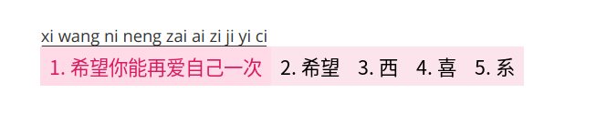

# fcitx5-moe

The pink fcitx5 theme is based on [fcitx5-nord](https://github.com/tonyfettes/fcitx5-nord) by modifying simple parameters

## Screenshot



## Usage

### Installation

```sh
git clone https://github.com/nowcube/fcitx5-moe.git
mkdir -p ~/.local/share/fcitx5/themes/
cd fcitx5-moe
cp -r Moe-Pink-Light/ ~/.local/share/fcitx5/themes/
```

### Enabling

In `~/.config/fcitx5/conf/classicui.conf`, change the `Theme` line as

```sh
Theme=Moe-Pink-Light
```

Then restart fcitx5 to apply the theme.

```sh
fcitx5 -r
```
