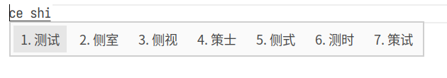
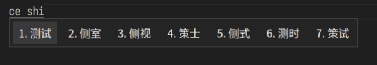

# fcitx5-moe-theme

## moe-pink-light
The pink fcitx5 theme is based on [fcitx5-nord](https://github.com/tonyfettes/fcitx5-nord) by modifying simple parameters

## adw-light/adw-dark
The color scheme of this theme is similar to that of Gnome.

## Screenshot
### moe-pink-light

### adw-light

### adw-dark



## Usage

### Installation

```sh
git clone https://github.com/nowcube/fcitx5-moe.git
mkdir -p ~/.local/share/fcitx5/themes/
cd fcitx5-moe
cp -r Moe-Pink-Light/ ~/.local/share/fcitx5/themes/
cp -r adw-light/ ~/.local/share/fcitx5/themes/
cp -r adw-dark/ ~/.local/share/fcitx5/themes/
```

### Enabling

In `~/.config/fcitx5/conf/classicui.conf`, change the `Theme` line as

```sh
Theme=Moe-Pink-Light
```
or
```sh
Theme=adw-light
```
or
```sh
Theme=adw-dark
```

Then restart fcitx5 to apply the theme.

```sh
fcitx5 -r
```
